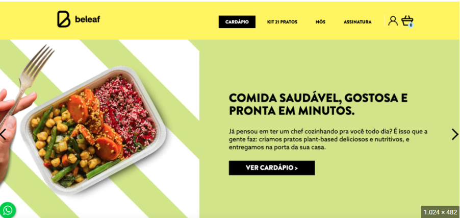

# Aula 00 - Da imagem para Web - Reproduzindo um Site com Flexbox - Criando um site de Comandas e Mesas

Prezados Alunos, nesta aula prática, vamos mergulhar no mundo do Flexbox para recriar um site com base em uma imagem de referência. Se você já se perguntou como os layouts flexíveis funcionam ou deseja aprimorar suas habilidades de design responsivo, este vídeo é para você! Usando HTML, CSS e a poderosa Flexbox, vou guiá-lo através de cada etapa do processo de desenvolvimento. Desde a estruturação básica até a disposição de elementos, você aprenderá técnicas essenciais para criar layouts dinâmicos.

Não se preocupe se você é novo em Flexbox ou design web; este tutorial é perfeito para iniciantes e intermediários. Vamos construir juntos e explorar as possibilidades infinitas que o Flexbox oferece para a criação de sites modernos e adaptáveis. Assista agora e comece a dominar o Flexbox enquanto reproduzimos um site com base em uma imagem! Não se esqueça de se inscrever no canal para mais tutoriais e dicas de desenvolvimento web.

## Segue alguns links: 
- Link para usar clip-path: https://bennettfeely.com/clippy/
- Download do Arquivo apresentado: Alunos e Professores https://drive.google.com/file/d/1iZ8re6Hv0_MQe1mgTuQdrbOQerriACBD/view?usp=sharing
- Download dos arquivos no google Drive: https://drive.google.com/file/d/19zKboBGFobogbd029pzJWrPB_Hkzd87W/view?usp=sharing

